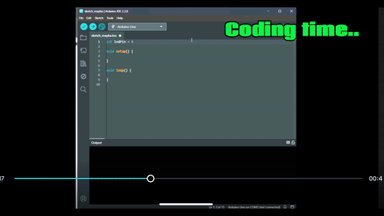

# LED-Fading-Effect

## Analog Output. Smooth Transitions. No Handholding.

**Sixth step** in the embedded grind. This ain’t a basic on/off flicker — it’s **pulse-width modulation mastery**. **One pin. One LED. Smooth fades in and out.** You’re not just flipping bits. You’re shaping signals.

---

## 🧭 Why This Matters

Real systems don’t just turn on — they breathe, they **transition**, they **modulate**. That’s PWM. You’re not coding light; you’re crafting it. This is how screens dim, motors hum, and LEDs dance.

### ⚙️ What I Learned

- `analogWrite()` delivers variable voltage via PWM  
- `for` loops shape time-based changes  
- Small `delay()` steps = smooth animation  
- Fading builds patience and precision — core traits in embedded design  

---
## 🔩 Parts I Used


- 1x LED  
- 1x 220Ω Resistor  
- 1x Arduino Uno (or compatible)  
- Jumper wires  
- Breadboard  

---

## 📈 Schematic


---
## 🛠️ Wiring


- **LED anode** → pin 5 via 220Ω resistor  
- **LED cathode** → GND  

---

## 👨‍💻 The Code



```cpp
int ledPin = 5;

void setup(){
  pinMode(ledPin, OUTPUT);
}

void loop(){
  // Fade in
  for (int fadeValue = 0; fadeValue <= 255; fadeValue += 5){
    analogWrite(ledPin, fadeValue);
    delay(30);
  }

  // Fade out
  for (int fadeValue = 255; fadeValue >= 0; fadeValue -= 5){
    analogWrite(ledPin, fadeValue);
    delay(30);
  }
}
```
---
## 🧠 The Concept
This isn’t just brightness—it’s signal shaping. You’re teaching the microcontroller to breathe life into light. This is how you learn timing, modulation, and patience in one go.

---
## 🎬 Final Result


- LED fades in.
- LED fades out.
- No button. No nonsense. Just pulse-driven control.

# 🎥 Full Video: https://youtu.be/K2Gba9SNvhc
